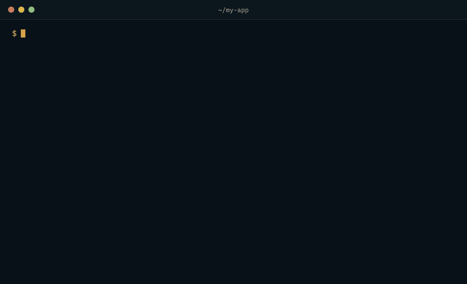

# Env Holster

**Replace `.env` files with an encrypted vault you can commit to git.**

[](https://github.com/envholster/envholster/actions/workflows/ci.yml)
[](LICENSE)

Editors, coding agents, sync tools and a stray `git add .` all read your
project folder. Env Holster moves the values out of `.env` and into
`secrets.holster`, an encrypted file that lives in the repository.
`envholster run` decrypts it in memory and starts your app with the same
environment it had before. Anything that only reads the project folder finds
ciphertext.

One Rust binary for macOS and Linux. No account, no server, no telemetry.

> [!IMPORTANT]
> 0.2.0 is the first public release. The code has **not** had an independent
> security review; one is planned before 1.0. Read
> [what it protects](#what-it-protects) before you rely on it.

<p align="center">
  
</p>

## Install

```sh
curl --proto '=https' --tlsv1.2 -fsSL https://github.com/envholster/envholster/releases/latest/download/install.sh | sh
```

The installer checks the release signature with your system OpenSSL before it
runs anything it downloaded, installs to `~/.local/bin`, and starts guided
setup. It needs no sudo, Rust or Node. Supported: macOS on Apple silicon and
Intel, and Linux with glibc (Ubuntu 22.04, Debian 12 or newer) on x86-64 and
ARM64.

To read the script first, download it, inspect it, then run `sh install.sh`.
[Verifying a release](SECURITY.md#verifying-a-release) checks a binary by hand;
the [install guide](docs/INSTALL.md) covers source builds, upgrades and
removal.

## Quick start

Guided setup migrates one project or many. It encrypts every value, saves a
separate recovery key and proves it works, wires your `dev` script, and only
then removes the untracked plaintext files.

```sh
envholster setup
```

Or migrate one project by hand:

```sh
cd my-app
envholster init                        # machine key, empty vault, recovery key
envholster import .env --encrypt-all   # encrypt every value, offer to delete .env
envholster run -- npm run dev          # decrypt in memory and start the app
```

Commit the files it created: `secrets.holster`, `secrets.holster.recovery.age`,
`envholster.toml`, `.gitattributes` and `.gitignore`. Then move the recovery
key off this machine:

```sh
envholster recovery create --to /Volumes/USB/envholster.key
```

That key and the committed recovery file restore every value, with or without
Env Holster: stock `age` and `jq` are enough.

## What it protects

It keeps plaintext keys out of your project folder. Coding agents loading files
into context, `git add .`, synced or zipped folders, screen shares and editor
extensions see ciphertext.

It does **not**:

- **Stop code running as you.** Anything with your user's access can read the
  machine key in `~/.config/envholster` or run `envholster get`.
- **Hide values from your app.** Whatever you start with `envholster run`,
  dependencies included, can read, log or send them.
- **Un-leak a key.** If a key was ever committed or shared, rotate it with the
  provider.

**Didn't you just move the key to `~/.config`?** Yes, and that is the point.
The project folder is read, indexed, uploaded and shared all day; the key now
sits in one place outside every repository, and the vault can be committed and
backed up without exposing values. A coding agent that can run commands as you
can still decrypt, by calling `envholster get` or reading your app's
environment. Stopping that needs OS-level isolation, which this version does not
provide; [PLAN.md](PLAN.md) describes that next step. The full threat model is
in [SECURITY.md](SECURITY.md#threat-model).

## How it works

| File | Contents | Committed |
|---|---|---|
| `secrets.holster` | Encrypted values | Yes |
| `secrets.holster.recovery.age` | Encrypted snapshot for the recovery key | Yes |
| `envholster.toml` | Secret names, environments, and any plain settings you approve | Yes |
| `~/.config/envholster/` | This machine's key | Never |

Values are encrypted with XChaCha20-Poly1305 (RustCrypto), grouped into one
block per environment and tier. Each block's key is wrapped with
[age](https://age-encryption.org) to every key allowed to open it, always
including the recovery key. Git sees secret names, ciphertext and roughly how
long the values are, never the values themselves. The container format is
custom and unreviewed; the [vault](docs/ENVELOPE-SPEC.md) and
[recovery](docs/RECOVERY-SPEC.md) formats are specified.

`init` and `import` register a git merge driver in that clone, so concurrent
changes to `secrets.holster` merge record by record; `envholster.toml` merges as
ordinary text. `envholster doctor` warns where the driver is missing.

## Everyday use

| Task | Command |
|---|---|
| Run with an environment | `envholster --env production run -- npm run build` |
| Add or change a secret | `envholster set NAME` (no-echo prompt, or `--stdin`) |
| List names, never values | `envholster list` |
| Print one value | `envholster get NAME` |
| Tools that read a file | `envholster run --dotenv -- prisma migrate dev` |
| Check machine and project | `envholster doctor` |

**Next.js and Vite.** `envholster import .env --profile nextjs` (or `vite`)
imports layered dotenv files in the framework's order. Choose the environment
with `--env`; `NODE_ENV` does not select it. See the
[migration guide](docs/MIGRATION.md).

**Another machine or CI.** Run `envholster identity generate` there, enroll the
printed public key here with `envholster recipient add age1… --label laptop`,
and commit the vault. In CI, put the key in `ENVHOLSTER_IDENTITY`. Enrolling a
key grants decryption of every commit it can open; there is no remove command
yet, and removal could never revoke old commits.

**Coding agents.** `envholster setup agents` teaches Codex, Claude Code and
Cursor to launch apps through `envholster run` instead of reading keys. It is
guidance, not a sandbox. See [agent setup](docs/AGENT-SETUP.md).

## Status

Single-user and local, on macOS and Linux. There is no daemon, per-request
approval, audit log or agent sandbox yet; [PLAN.md](PLAN.md) lays out that
direction. Report vulnerabilities privately through [SECURITY.md](SECURITY.md).
Build and release controls are in [SUPPLY_CHAIN.md](SUPPLY_CHAIN.md), and
[CONTRIBUTING.md](CONTRIBUTING.md) explains how to help.

## License

[Apache-2.0](LICENSE)
